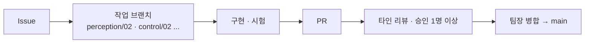
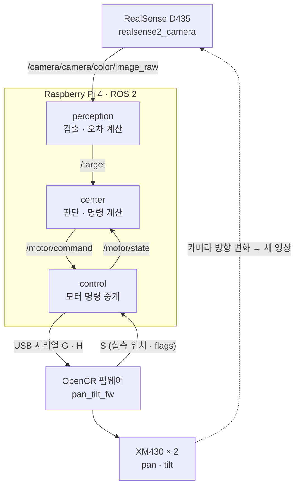
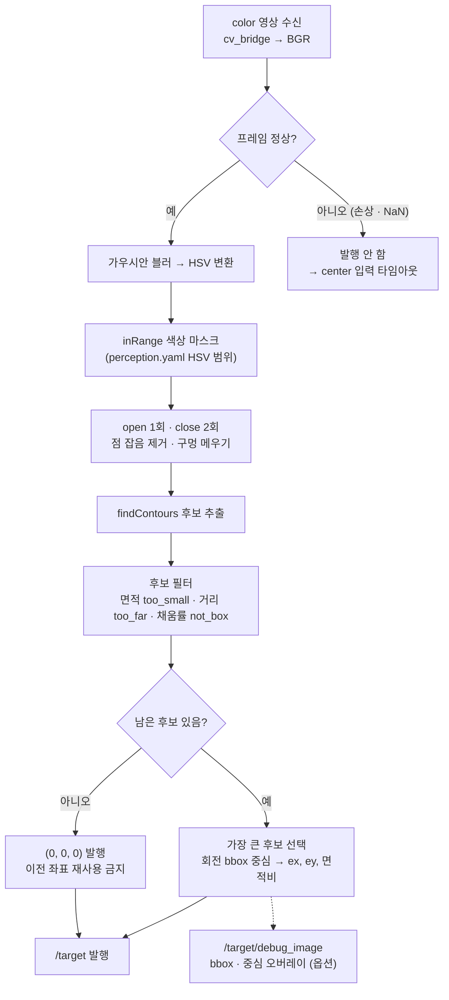
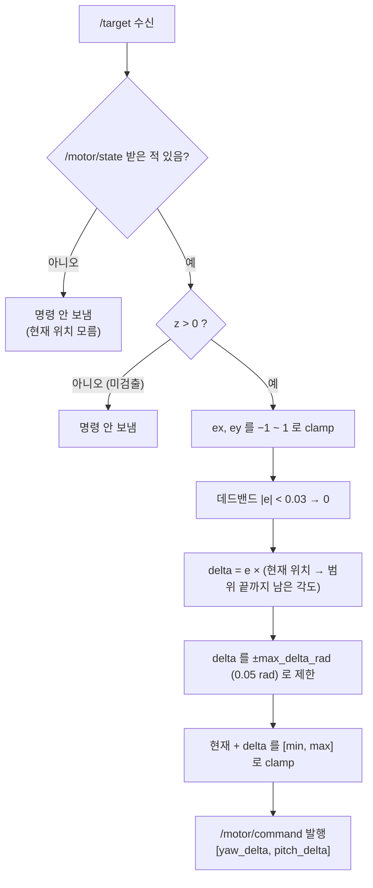
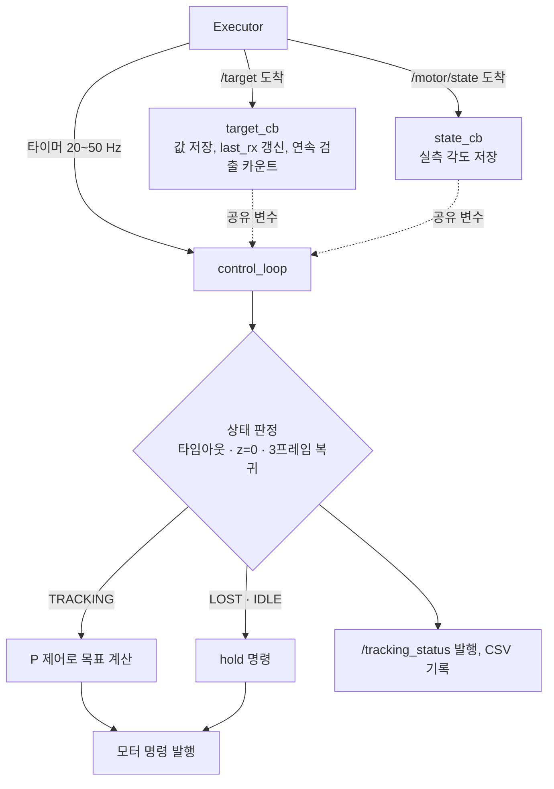
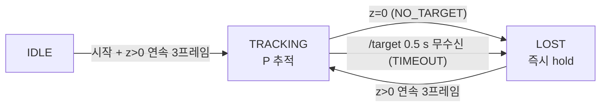
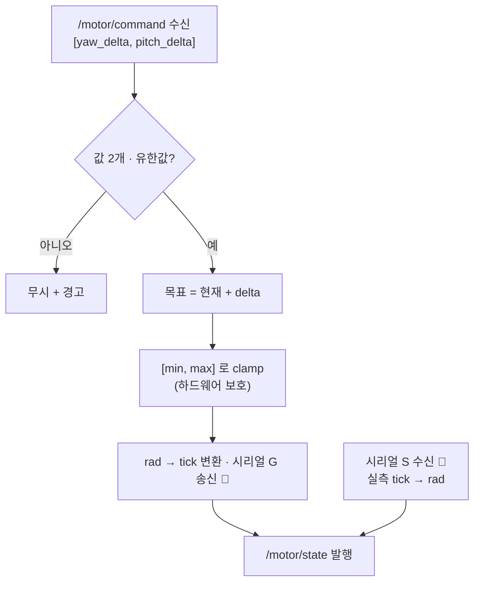
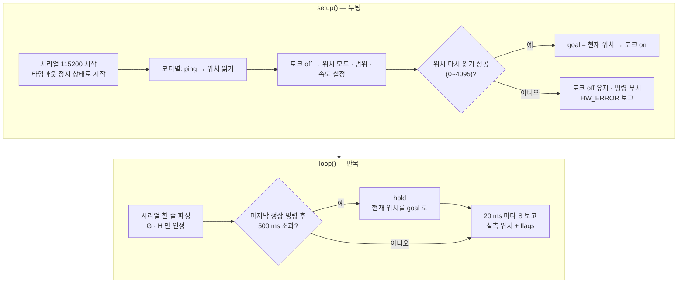
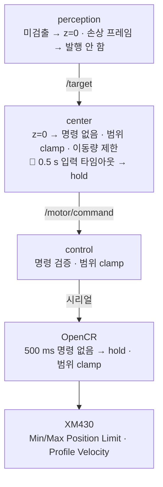
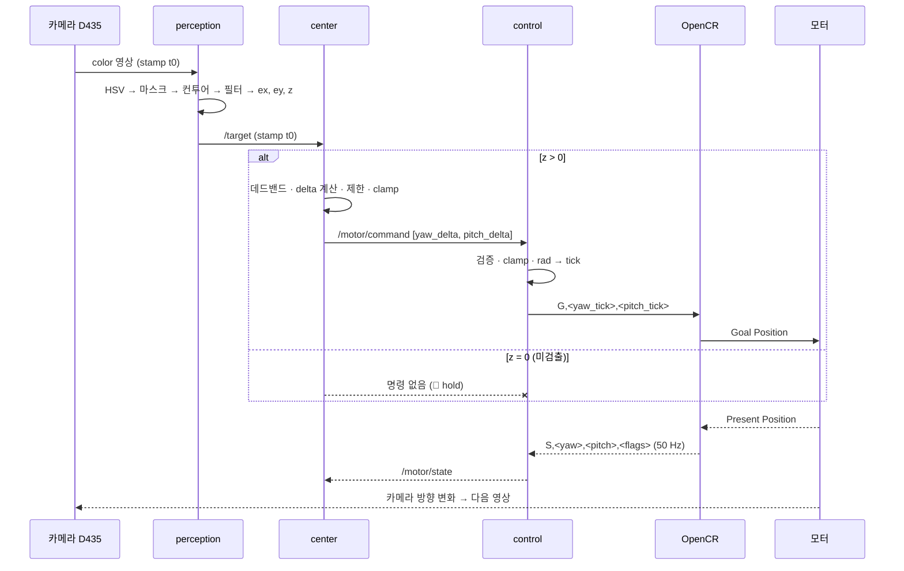

# Horus — 비전 객체 추적 시스템 발표 자료

PPT 슬라이드 순서대로 작성한다. 슬라이드 하나 = `##` 절 하나.

- 표시 규칙: **✅ 구현** = `main` 에 병합된 코드 · **🔲 설계** = 설계만 있고 아직 구현 전
- 기준: `main` @ `e35c1ee` (PR #9 병합까지)
- 측정값(FPS·검출률·RMSE·복구 시간)은 아직 없다. 시험 후 원본 로그로만 채운다.

---

## 1. 개요

**카메라로 파란 블록을 찾아, 화면 중앙에 오도록 모터가 카메라를 돌린다.**

> 카메라 영상 → HSV·Contour 검출 → 중심 오차 → 추적 제어 → OpenCR → 다이나믹셀 → 카메라 방향 변화 → 새 영상의 오차 확인

| 핵심 질문 | 우리 답 |
| --- | --- |
| 무엇을 따라가나 | 단일 색상 목표 1개 (파란 블록) |
| 어떻게 따라가나 | 정규화 중심 오차 → P 방식 위치 명령 |
| 안전하게 멈추나 | 목표 소실 · 입력 끊김 · 제어 통신 끊김 각각 정지 |
| 재현되나 | README · 설정 파일 · bag 으로 다른 팀원이 재실행 |

- 4인 1조, ROS 2 노드 3개(perception · center · control) + OpenCR 펌웨어
- 발제 필수: 수평 1축 추적 / 우리 목표: 2축(pan · tilt)까지 (선택 도전)

---

## 2. 장비 · 환경 · 목표

### 장비

| 구분 | 사용 장비 |
| --- | --- |
| 메인 보드 | Raspberry Pi 4 (헤드리스, PC에서 SSH) |
| 카메라 | Intel RealSense D435 — 컬러 640×480 · 30 FPS (+ 거리 필터용 depth) |
| 모터 제어 보드 | OpenCR |
| 모터 | DYNAMIXEL XM430-W350 × 2 (pan · tilt, 위치 제어) |
| 목표물 | 파란색 블록 |

### 소프트웨어 환경

| 항목 | 버전 |
| --- | --- |
| OS | Ubuntu Server 26.04 |
| ROS 2 | Lyrical |
| OpenCV | 4.10.0 |
| 노드 언어 | C++ (`rclcpp`) |
| 펌웨어 | Arduino(OpenCR 코어) + Dynamixel2Arduino |

### 목표

| 구분 | 내용 |
| --- | --- |
| 필수 | HSV · Contour 검출, ROS 2 인지 · 제어 연결, 수평 1축 P 추적 |
| 필수 | 목표 소실 · 통신 단절 시 **안전 정지**, 시야 안 재등장 시 **복귀** |
| 필수 | bag 기록 · 재현, 다른 팀원 실행 확인 |
| 선택 | 2축(pan · tilt) 추적 |

---

## 3. 파트 분배 및 역할 분담

| 이름 | 역할 | 맡은 파트 | 주요 결과물 |
| --- | --- | --- | --- |
| 송정혁 | 팀장 · 검증 | 구조 설계, 저장소 · 리뷰 운영, 시험 · 문서 | README · 인터페이스 표, `team.md`, `report.md` |
| 정조은 | 인지 | perception 노드 | HSV · Contour 검출기, depth · 채움률 필터 |
| 이창엽 | 통합 | center · control 노드 | 노드 뼈대, `/target` → `/motor/command` 연결, 설정 yaml |
| 한지훈 | 제어 | OpenCR 펌웨어 · 모터 | 장비 확인 스케치, `device.yaml`, `pan_tilt_fw` |

### 협업 방식

- `main` 보호: PR 필수, 작성자 외 승인 1개 이상, 새 커밋 시 재승인, force push 금지
- 하드웨어 시험은 한 명씩, Raspberry Pi 에서는 각자 개인 clone 폴더 사용

---

## 4. 전체 구조와 인터페이스

### 노드 구조

| 노드 | 하는 일 | 하지 않는 일 |
| --- | --- | --- |
| perception | 목표 검출, 정규화 오차 · 면적비 발행, 미검출 시 `z=0` | 상태 결정, 모터 명령 |
| center | 명령 계산, 범위 · 속도 제한, (설계) 상태 결정 · 입력 타임아웃 | 영상 처리, 시리얼 통신 |
| control | 명령을 OpenCR 로 전달, 모터 상태 발행 | 오차 계산, 상태 결정 |
| OpenCR | 모터 구동, 통신 끊김 정지, 범위 · 속도 제한 | 오차 계산 |

### 토픽

| 토픽 | 타입 | 발행 → 구독 | 내용 | 상태 |
| --- | --- | --- | --- | --- |
| `/target` | `geometry_msgs/PointStamped` | perception → center | x=`ex`, y=`ey`, z=면적비, **z=0 미검출**, best-effort · depth 1 | ✅ |
| `/motor/command` | `std_msgs/Float64MultiArray` | center → control | `[yaw_delta, pitch_delta]` 상대 이동량 [rad] | ✅ |
| `/motor/state` | `geometry_msgs/PointStamped` | control → center | x=yaw, y=pitch 현재 각도 [rad] | ✅ (현재는 내부 값) |
| `/target/debug_image` | `sensor_msgs/Image` | perception → PC | bbox · 중심 오버레이 (옵션) | ✅ |
| `/tracking_status` | `std_msgs/String` | center → PC | `IDLE` / `TRACKING` / `LOST` | 🔲 |

### `/target` 규약 (발제)

- `ex = (cx − W/2) / (W/2)`, `ey = (cy − H/2) / (H/2)` — 오른쪽 · 아래가 `+`, 범위 −1 ~ +1
- `z` = 컨투어 면적 / 화면 면적. **`z = 0` 이면 미검출 → x · y 로 제어하지 않음**
- `header.stamp` = 원본 영상 시각

### 시리얼 프로토콜 (control ↔ OpenCR, 115200, 한 줄 = 한 메시지)

| 메시지 | 방향 | 형식 | 의미 |
| --- | --- | --- | --- |
| G | RPi → OpenCR | `G,<yaw_tick>,<pitch_tick>` | 목표 위치로 이동 |
| H | RPi → OpenCR | `H` | 현재 위치에서 정지 |
| S | OpenCR → RPi | `S,<yaw_tick>,<pitch_tick>,<flags>` | 50 Hz 실측 위치 · 상태 |

---

## 5. perception 노드 내부 구조

**영상 한 장 → `/target` 메시지 한 개.** OpenCV 는 이 노드 안에서만 쓴다. ✅

| 단계 | 설정 키 (`config/perception.yaml`) | 현재 값 |
| --- | --- | --- |
| HSV 범위 | `hsv_ranges` | H 98~118, S 190~255, V 25~230 |
| 최소 면적 | `min_area_px` | 300 px |
| 잡음 제거 | `blur_ksize`, `morph_kernel` | 5, 5 |
| 중심 계산 | `bbox_style` | `rotated` (minAreaRect) |
| 거리 필터 | `max_distance_m` | 1.5 m (depth 사용) |
| 모양 필터 | `min_fill_ratio` | 0.5 (면적 / 회전 bbox 면적) |

### 결과 3가지

| 상황 | 출력 |
| --- | --- |
| 목표 검출 | `(ex, ey, 면적비)`, z > 0 |
| 정상 프레임 · 목표 없음 | `(0, 0, 0)` 발행 |
| 프레임 손상 · NaN | **발행하지 않음** (미검출과 "입력 끊김"을 구분) |

- 검출 로직은 ROS 와 분리된 라이브러리(`perception_core`) → PC 에서 단독 시험 가능
- 처리 FPS 측정 시 디버그 영상 발행을 끈다

---

## 6. center 노드 내부 구조

**`/target` 오차 → 모터가 움직일 상대 이동량.**

### 현재 구현 ✅ — `/target` 콜백에서 바로 명령 계산

| 파라미터 (`config/center.yaml`) | 의미 |
| --- | --- |
| `yaw_min/max`, `pitch_min/max` | 회전 범위 [rad] |
| `max_delta_rad` | 한 번에 움직일 수 있는 최대 각도 (속도 상한 역할) |
| `deadband` | 중앙 근처 떨림 방지 |

### 다음 단계 🔲 — 타이머 기반 상태머신 (설계)

콜백은 값만 저장하고, **명령은 주기 타이머에서만** 낸다. 메시지가 끊겨도 타이머가 돌아 타임아웃을 감지한다.

- P 제어식(설계): `goal[k] = clamp(goal[k−1] + dir × Kp × e × dt, min, max)`, `|delta| ≤ speed × dt`
- Kp 2종 비교 시험은 이 구조에서 진행

---

## 7. motor 노드 내부 구조 (control 노드 + OpenCR 펌웨어)

### control 노드 — ROS ↔ 모터 중계

- ✅ 명령 검증 · 범위 clamp · `/motor/state` 발행 (현재는 내부 계산값)
- 🔲 OpenCR 시리얼 연결 — 연결 후 `/motor/state` 는 **실측 위치(S)** 를 쓴다
- 변환: `rad = (tick − center_tick) × 2π / 4096` (1 tick ≈ 0.088°)

### OpenCR 펌웨어 `pan_tilt_fw` ✅

| 파일 | 역할 |
| --- | --- |
| `config.h` | ID, 안전 범위, 속도, 타임아웃, flags |
| `motor.cpp` | 초기화, 이동, hold, 범위 clamp, 상태 읽기 |
| `protocol.cpp` | G · H 파싱, 타임아웃 판정, S 보고 |

| flags | 1 | 2 | 4 | 8 |
| --- | --- | --- | --- | --- |
| 의미 | HOLD 정지 중 | TIMEOUT 명령 끊김 | LIMIT 범위로 잘림 | HW_ERROR 모터 오류 |

---

## 8. 정지 · 보호 동작 처리

**위치형 모터는 "명령을 멈춘다 ≠ 정지"다.** 마지막 목표까지 계속 움직인다. 그래서 정지 = **현재 위치를 목표로 다시 쓰는 hold**.

아래 층일수록 마지막 안전망. RPi 쪽 정지는 RPi 프로세스가 살아 있어야 동작하므로, **OpenCR 이 스스로 끊김을 감지**해야 한다 (발제 필수).

| 상황 | 감지 위치 | 동작 | 상태 |
| --- | --- | --- | --- |
| 목표 미검출 | perception → center | `z=0` 발행 → 명령 안 보냄 | ✅ (🔲 hold 명령으로 전환) |
| 프레임 손상 | perception | 발행 안 함 → 입력 타임아웃으로 처리 | ✅ |
| `/target` 끊김 (인지 노드 정지) | center | 0.5 s 무수신 → LOST + hold | 🔲 |
| 제어 통신 끊김 | OpenCR | 올바른 G · H 500 ms 없음 → hold, flags=TIMEOUT | ✅ 시험 로그 |
| 범위 밖 목표 | center · control · OpenCR · 모터 | 4중 clamp, flags=LIMIT | ✅ 시험 로그 |
| 급격한 이동 | center · 모터 | `max_delta_rad` 제한, Profile Velocity 20 (≈0.48 rad/s) | ✅ |
| 부팅 시 위치 읽기 실패 | OpenCR | 토크 off 유지, 명령 무시, HW_ERROR | ✅ |
| 잘못된 시리얼 줄 · 잡음 | OpenCR | 무시, 타임아웃 타이머 리셋 안 함 | ✅ |
| 끊긴 뒤 자동 원점 복귀 | — | **하지 않음** ("계속 움직이지 않는다"와 충돌) | 원칙 |

### 펌웨어 단독 시험 (모터 저속 · 손으로 받친 상태)

| 시험 | 확인 기준 | 증빙 |
| --- | --- | --- |
| 명령 없이 부팅 | `S,…,3` (HOLD + TIMEOUT) | `results/logs/fw_hold_test_2026-10-06.txt` |
| 연속 명령 후 중단 | 0.5 s 안에 flags 0 → 3, 위치 변화 없음 | `results/logs/fw_timeout_test_2026-10-06.txt` |
| 범위 밖 목표 | 안전 범위 끝에서 멈춤, flags=4 | `results/logs/fw_limit_test_2026-10-06.txt` |

---

## 9. 한 프레임 시퀀스

- 마지막 줄이 **폐루프**: 모터가 움직이면 다음 영상의 오차가 줄어든다
- control ↔ OpenCR 시리얼 구간(G · S)은 펌웨어 단독 시험까지 완료, ROS 연결은 🔲
- 지연 측정 시 "영상 수신 → 명령 생성"과 "모터 실제 반응"을 구분해서 보고한다

---

## 10. 트러블슈팅

| # | 문제 | 원인 | 해결 |
| --- | --- | --- | --- |
| 1 | Raspberry Pi 에서 OpenCR 펌웨어 빌드 · 업로드 불가 | 공식 OpenCR 코어의 컴파일러 · 업로더가 x86-64 전용 (RPi 는 arm64) | apt `gcc-arm-none-eabi` 로 컴파일러 대체, 업로더 `opencr_ld` 를 소스에서 arm64 로 빌드, `platform.local.txt` 로 경로 지정 |
| 2 | OpenCR 코어 압축 해제 실패 | 파일 이름은 `.tar.bz2` 인데 실제 형식은 gzip | `tar xzf` 로 해제 |
| 3 | 재연결할 때마다 포트 번호 변경 (`ttyACM0` ↔ `ttyACM1`) | USB 연결 순서에 따라 번호가 바뀜 | udev 규칙으로 고정 이름 `/dev/opencr` |
| 4 | 시리얼에 알 수 없는 문자 유입 | ModemManager 가 OpenCR 을 모뎀으로 보고 `AT\r` 전송 | ModemManager 중지 · 비활성. 펌웨어는 `\r` 도 줄 끝으로 처리, 형식이 틀린 줄은 무시 · 타임아웃 리셋 안 함 |
| 5 | 부팅 시 모터가 범위 끝으로 튈 위험 | 위치 읽기 실패 시 값 0 → 안전 범위 최솟값으로 clamp → 토크 on 순간 이동 | 위치 읽기 재시도 + 0~4095 확인, 실패하면 토크 off 유지 · 명령 무시 (fix 커밋 `cf37b72`) |
| 6 | 배경의 파란 물체 오검출 | HSV 만으로는 같은 색 배경과 구분 불가 | depth 거리 필터(1.5 m), 채움률 필터(0.5)로 블록 모양만 남김 |
| 7 | pan 축 케이블 간섭 | 기구상 회전 가능 범위보다 케이블이 먼저 걸림 | 토크 off 상태에서 손으로 돌려 범위 측정 → 끝값에서 100 tick(≈8.8°) 안쪽을 안전 범위로 사용 |
| 8 | D435 장치 접근 설정 | RealSense udev 규칙이 apt 패키지에 없음 | librealsense 버전(2.58.4)과 같은 태그의 udev 규칙 수동 설치, USB 3 포트 직결 (허브 사용 안 함) |

---

## 11. Q&A

질문 받습니다.

예상 질문 메모 (발표자용)

| 질문 | 답변 요지 |
| --- | --- |
| 미검출과 통신 끊김을 어떻게 구분하나? | 미검출은 `z=0` 메시지가 **온다**. 끊김은 메시지가 **안 온다** → 수신 시각 기준 타임아웃 |
| 왜 OpenCR 에도 타임아웃이 필요한가? | RPi 노드가 죽거나 SSH 가 끊기면 RPi 쪽 정지 로직도 같이 멈춘다. 보드만이 마지막 안전망 |
| 위치형인데 명령을 안 보내면 멈추지 않나? | 마지막 목표까지 계속 이동한다. 그래서 현재 위치를 목표로 덮어쓰는 hold 를 쓴다 |
| 정지를 어떻게 확인했나? | 명령 로그가 아니라 S 메시지의 **실측 위치가 변하지 않음**으로 확인 (펌웨어 시험 로그) |
      