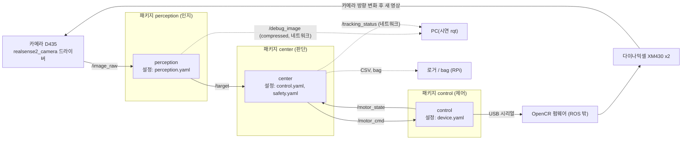
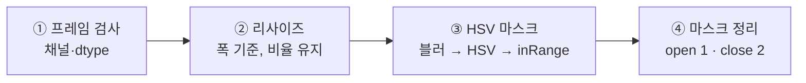
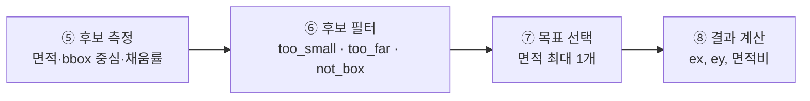
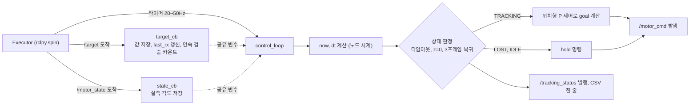
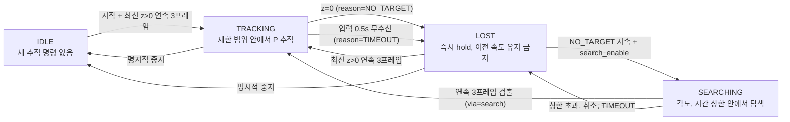
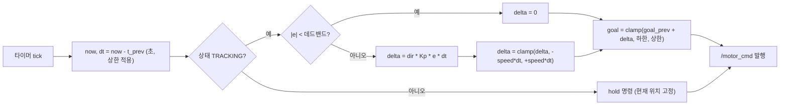
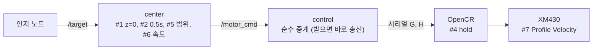

# 1. 개요

---

## 목표

- 파란 퍽 검출
- 화면 중앙에 오도록 모터 회전 (2축)
- 목표를 잃거나 통신이 끊기면 -> **안전 규약 이행**
- 

---

## 장비

| 항목  |                                                     |
| --- | --------------------------------------------------- |
| 보드  | Raspberry Pi 4, Ubuntu 26.04, ROS 2 Lyrical, SSH 접속 |
| 카메라 | RealSense D435, 640×480, 30 FPS                     |
| 모터  | XM430-W350, ID 11·12, protocol 2.0, 위치형, USB 시리얼    |
| 중계  | OpenCR                                              |


---

# 2. 역할 분담

---

## 역할

| 이름  | 역할      | 주요 책임                              |
| --- | ------- | ---------------------------------- |
| 송정혁 | 팀장 · 검증 | 구조 설계, 검증·시험, 결과 해석·발표             |
| 정조은 | 인지      | 카메라 입력, HSV·Contour, 미검출 처리, 검출 증거 |
| 한지훈 | 제어      | 모터 연결, 오차→명령, 속도·위치 제한, 정지         |
| 이창엽 | 통합      | ROS 2 인터페이스, 실행 구성, bag 기록·재생      |

---


# 3. 전체 구조

---

## 패키지 · 노드 · 토픽



- 노드는 토픽으로만 통신
- 패키지 = 노드·launch·config 빌드 단위
- 설정은 yaml → launch 파라미터

| 파일                       | 키                                              |
| ------------------------ | ---------------------------------------------- |
| `config/perception.yaml` | HSV 범위, 최소 면적, 해상도                             |
| `config/control.yaml`    | Kp, direction, speed_limit, 회전 범위, 데드밴드, 제어 주기 |
| `config/safety.yaml`     | 입력 타임아웃, 복귀 프레임 수, 상태 유예                       |
| `config/device.yaml`     | 포트, 모터 ID, baud, TIMEOUT_MS                    |

---

# 4. 인지 구조

---

## 노드 입출력

| 구분  | 토픽                                   | 타입            | 내용                     |
| --- | ------------------------------------ | ------------- | ---------------------- |
| 구독  | `/camera/camera/color/image_raw`     | Image (rgb8)  | D435 color 640×480     |
| 구독  | `…/aligned_depth_to_color/image_raw` | Image (16UC1) | `max_distance_m` 설정 시만 |
| 발행  | `/target`                            | PointStamped  | x=ex, y=ey, z=면적비      |
| 발행  | `/target/debug_image`                | Image (bgr8)  | 오버레이, 기본 꺼짐            |
| 발행  | `/target/debug_mask`                 | Image (mono8) | 최종 마스크, 기본 꺼짐          |

- QoS best-effort, depth 1 (구독도 best-effort, reliable 이면 연결 안 됨)
- 영상 1장마다 1회 발행, 타이머 재발행 없음
- 설정은 `perception.yaml` 하나, 모르는 키 있으면 시작 안 함
- 처리 FPS·검출 수·발행 안 함 수 5초 주기 로그

## 검출 





- `TargetDetector::process_debug()` 한 함수에 단계 순서대로
- `perception_core` 정적 라이브러리, ROS 의존 없음 → 노드·일괄 검출 도구 공용

---

## ③~④ HSV 마스크 생성·정리

| 항목       | 내용                                             |
| -------- | ---------------------------------------------- |
| 색 변환     | rgb8 → bgr8 (cv_bridge) → `GaussianBlur` → HSV |
| 범위       | HSV `[98,190,25] ~ [118,255,230]`              |
| 범위 근거    | bag 프레임으로 튜닝, 연한 파랑(하늘색 셔츠·텀블러) 차단             |
| 원본 보호    | 블러 결과는 새 Mat                                   |
| open 1회  | 점 잡음 제거 (타원 커널 5px)                            |
| close 2회 | 블록 안 구멍·틈 메움                                   |

---

## ⑤~⑥ 후보 측정·필터

| 제외 사유 | 조건 | 막는 것 |
| --- | --- | --- |
| `too_small` | 면적 < 300 px | 카펫·그림자 점 잡음 |
| `too_far` | 거리 > 1.5 m (정렬 depth, 5×5 중앙값) | 작업 범위 밖 파란 물체 |
| `not_box` | 채움률 < 0.5 | 옷·몸 덩어리 |

- 외곽 컨투어만 (`RETR_EXTERNAL`)
- 중심 = 회전 bbox 중심 (`minAreaRect`)
- 채움률 = 컨투어 면적 / 회전 bbox 면적
- depth 없음·측정 실패면 거리로 제외 안 함

---

## ⑦~⑧ 목표 선택·결과 계산

| 항목 | 내용 |
| --- | --- |
| 선택 | 면적 최대 후보 1개 |
| `ex`, `ey` | −1 ~ 1, 오른쪽·아래 + |
| W·H | 실제 처리 프레임 크기 |

`ros2_ws/src/perception/src/detector.cpp` — `normalize_error()`, `area_ratio()`

```cpp
const double half_width  = width  / 2.0;
const double half_height = height / 2.0;
return {(cx - half_width) / half_width, (cy - half_height) / half_height};  // ex, ey

return area_px / (static_cast<double>(width) * height);           // z = 면적비
```

---

## 필터 근거와 bag 시험

| 손에 든 퍽 (10/02)               | 조명 변화                       | 하늘색 셔츠                       |
| ---------------------------- | --------------------------- | ---------------------------- |
| ![[Horus 인지 bag 손에 든 퍽.gif]] | ![[Horus 인지 bag 조명 변화.gif]] | ![[Horus 인지 bag 하늘색 셔츠.gif]] |
| 487 / 494                    | 123 / 123                   | 47 / 49                      |

- 숫자 = 검출 프레임 / 전체 프레임 (`batch_detect` 재처리, 6프레임 간격 5 fps)
- color만 사용 → `too_far` 미반영
- 사람 대조 검출률은 별도 (30 + 10 프레임)

---

# 5. 판단(center) 구조

---

## center 노드 내부 (콜백·타이머)



콜백은 저장만, 명령은 **타이머에서만** -> 메시지가 끊겨도 타이머가 돌아 타임아웃 감지 
- 단일 스레드 Executor → 잠금 불필요

---

## 상태 전이



- 상태는 `center` 한 곳에서 결정
- 원인은 상태를 늘리지 않고 `reason` 으로 구분

---

## 코드 · 상태머신

`ros2_ws/src/center/src/center_node.cpp` — `TrackingStateMachine::update()` (ROS 의존 없음)

`input_timeout_sec_` : 타임아웃 기준 시간
`resume_frames_` : 검출 인지 기준 프레임 수

```cpp
const bool timed_out = has_input_ && (now_sec - last_input_sec_) > input_timeout_sec_;
if (timed_out) consecutive_detect_ = 0;          // 끊긴 동안의 검출 수는 무효
const bool target_confirmed = !timed_out && consecutive_detect_ >= resume_frames_;
const bool new_no_target = has_new_frame_ && !new_frame_detected_;   // 새로 온 프레임이 미검출

switch (state_) {
  case Idle:     if (target_confirmed) change_state(Tracking, "TARGET_CONFIRMED"); break;
  case Tracking: if (timed_out)          change_state(Lost, "TIMEOUT");
                 else if (new_no_target) change_state(Lost, "NO_TARGET");          break;
  case Lost:     if (target_confirmed) change_state(Tracking, "TARGET_CONFIRMED"); break;
}
```

---


## 코드 · 수신과 주기 검사

`ros2_ws/src/center/src/center_node.cpp` — `on_target()`, `stateTimerCallback()`

```cpp
void on_target(double now_sec, bool detected) {     // /target 콜백에서
  has_input_ = true;
  last_input_sec_ = now_sec;                        // 노드 시계로 기록
  consecutive_detect_ = detected ? consecutive_detect_ + 1 : 0;
}

void stateTimerCallback() {                         // state_check_period_sec = 0.05
  const rclcpp::Time now = this->now();
  updateState(now);                                 // 메시지가 없어도 TIMEOUT 판정
  if ((now - last_status_pub_).seconds() >= 1.0) publishStatus(now);
}
```

- `z=0` 도 메시지 도착 → `last_input_sec_` 갱신 → 타임아웃 아님 (미검출 ≠ 침묵)

---


# 6. 제어(control) 구조

---

## 위치형 P 제어 루프



`goal[k] = clamp(goal[k-1] + dir × Kp × e × dt, min, max)`

---


## P 제어

`ros2_ws/src/center/src/center_node.cpp` — `targetCallback()`

```cpp
if (state_machine_.state() != TrackingState::Tracking) return;   // IDLE·LOST: 명령 없음

double error_x = std::clamp(ex, -1.0, 1.0);
if (std::fabs(error_x) < deadband_) error_x = 0.0;               // 데드밴드

double yaw_delta = -yaw_kp_ * error_x;                            // P 제어 [tick]
yaw_delta = std::clamp(yaw_delta, -max_delta_tick_, max_delta_tick_);   // 한 번 이동량 제한

const double target_yaw = std::clamp(current_yaw_ + yaw_delta, yaw_min_, yaw_max_);  // 범위
command.data = {target_yaw, target_pitch};
command_pub_->publish(command);                                   // /motor/command
```

pitch도 같은 식(`ey`). 기준은 실측 위치(`/motor/state`).

---


## 코드 · 시리얼 중계

`ros2_ws/src/control/src/control_node.cpp`

```cpp
// /motor/command → "G,<yaw>,<pitch>\n"
std::snprintf(line, sizeof(line), "G,%d,%d\n", yaw, pitch);
write(serial_fd_, line, std::strlen(line));

// "S,<yaw>,<pitch>,<flags>" → /motor/state (10 ms 타이머로 읽기)
if (std::sscanf(line.c_str(), "S,%d,%d,%d", &yaw, &pitch, &flags) != 3) return;
msg.point.x = yaw;  msg.point.y = pitch;  msg.point.z = flags;
state_pub_->publish(msg);
```

OpenCR 펌웨어

| 기능 | 내용 |
| --- | --- |
| 명령 수신 | `G,<yaw>,<pitch>` 파싱 후 goal 설정 |
| 상태 송신 | 현재 각도·상태를 주기 전송 |
| 정지·제한 | 7절 (보드 타임아웃, hold, 범위·속도 제한) |

---

# 7. 안전 · 보호 규약

---

## 보호 위치



| 층       | 기다리는 것         | 끊기면                |
| ------- | -------------- | ------------------ |
| center  | `/target` 0.5s | hold 명령            |
| control | `/motor_cmd`   | 보드에 `H`            |
| OpenCR  | 시리얼 명령         | 스스로 hold (마지막 안전망) |

각 층이 자기 타이머로 정지.


---

## 왜 보드에도 타임아웃인가

| 상황 | 결과 |
| --- | --- |
| tmux/systemd 실행, SSH만 끊김 | 노드 살아 있음, 추적 계속 |
| 일반 터미널 실행 후 SSH 끊김 | 프로세스 종료 → 보드 타임아웃 hold |
| 노드 크래시, RPi 정지 | 보드 타임아웃이 유일한 정지 수단 |

RPi 쪽 정지는 RPi 프로세스가 살아 있어야 동작한다.

---
## 코드 · 보드 타임아웃

`firmware/pan_tilt_fw/` — `pan_tilt_fw.ino`, `protocol.cpp`, `config.h`

```cpp
constexpr uint32_t CMD_TIMEOUT_MS = 500;           // 제어 통신 중단 판정

void loop() {
  protocol::poll();                                 // G·H 수신 시 last_cmd_ms 갱신
  const bool timed_out = protocol::timedOut();
  if (timed_out) motor::hold();                     // 제어 통신 중단 → 정지
  // 20 ms 마다 S,<yaw>,<pitch>,<flags> 보고
}

bool timedOut() { return (millis() - last_cmd_ms) > cfg::CMD_TIMEOUT_MS; }

// 시작 시: 명령이 오기 전까지 타임아웃 정지 상태
last_cmd_ms = millis() - cfg::CMD_TIMEOUT_MS - 1;
```

---

## 상황별 동작

| #   | 상황         | 감지              | 조건                              | 동작                    | 상태                |
| --- | ---------- | --------------- | ------------------------------- | --------------------- | ----------------- |
| 1   | 목표 미검출     | center          | `z=0` 첫 프레임                     | hold                  | `LOST(NO_TARGET)` |
| 2   | 인지 입력 끊김   | center          | `/target` 0.5 s 무수신             | 즉시 hold               | `LOST(TIMEOUT)`   |
| 3   | 판단 노드 끊김   | OpenCR (#4)     | `/motor_cmd` 끊김                 | #4 hold               | `TIMEOUT_STOP`    |
| 4   | 시리얼 끊김 1단계 | OpenCR          | `TIMEOUT_MS` 무수신                | hold                  | `TIMEOUT_STOP`    |
| 5   | 범위 끝       | center + OpenCR | goal이 min/max 밖                 | 바깥 delta = 0          | `LIMIT`           |
| 6   | 명령 속도 초과   | center          | `abs(delta) > speed_limit × dt` | delta 포화              | -                 |
| 7   | 모터 속도 초과   | OpenCR / XM430  | goal 급변                         | `Profile Velocity` 제한 | -                 |


시간·임계값은 예시, 장비에서 확정.

---

## 코드 · hold와 범위 제한

`firmware/pan_tilt_fw/motor.cpp`

```cpp
void hold() {
  if (!ready_ || holding_) return;
  readPresent();                                       // Present Position 읽기
  for (int k = 0; k < cfg::AXES; k++)
    writeGoal(k, clampToSafe(k, present_[k]));         // goal = 현재 위치
  holding_ = true;
}

void applyGoal(long raw_yaw, long raw_pitch) {
  if (!ready_) return;                                 // 초기화 실패면 이동 무시
  for (int k = 0; k < cfg::AXES; k++) {
    int32_t g = clampToSafe(k, raw[k]);                // SAFE_MIN ~ SAFE_MAX
    if (g != raw[k]) limited_ = true;                  // flag LIMIT
    if (holding_ || g != goal_[k]) writeGoal(k, g);
  }
  holding_ = false;
}
```
