규칙:

- 항목마다 발제 "report.md 작성 틀" 순서(구현 → 실행 조건 → 결과물 → 측정 결과 → 해석 → 심화 → 한계)를 따른다.
- 주장마다 코드 · 원본 기록 · 영상 · PR 링크를 연결한다. 수치는 원본 로그에서만 옮긴다.
- 수행하지 않은 결과는 채우지 않는다. 실패 · 무효 회차도 지우지 않는다.
- 시각 표기 "기록 x.xx s"는 해당 bag 시작 기준 초다. 상태 전이 시각은 `center_node` 로그를 bag 시작 시각에 맞춘 값이다.

## 요구사항별 요약

| 요구사항 | 핵심 증빙 |
|---|---|
| 목표 · 시험 조건 정의 | 아래 표, `config/control_kp20.yaml` · `control_kp40.yaml` |
| RPi · OpenCR 실행 환경 | [`README.md`](README.md#환경--장비), `results/logs/dxl_check_*`, `fw_*` |
| HSV · Contour 검출 | `config/perception.yaml`, `results/images/s2/`, [Drive `s2`](https://drive.google.com/drive/folders/1RsKe_UP-nIoB0clOWZ6N8gajRd98W7GX) |
| 인지 · 제어 인터페이스 | `s6_mock4`, `s6_resume2` (±0.3으로 시험, 발제 ±0.4) |
| P 추적 · 구동 제한 | `s3_kp20_run1~3`, `s3_kp40_run1~3`, [`s3_direction.txt`](https://drive.google.com/file/d/169s66uOPNiZeoaqaTlq3OSjtL4pDIm1Q/view) |
| 목표 소실 · 복구 | `s5_lost` 5/5 TRACKING 복귀 |
| 통신 중단 안전 정지 | `s6_stop`, `fw_timeout_test_2026-10-06.txt` |
| 성능 측정 · 해석 | 검출 판정 30 + 10프레임, Kp 6회 · 가림 5회 지표 |
| bag 기록 · 재현 | 입력 재처리 2회 (`s7_replay`), 결과 재분석 4개 bag |

---

## 목표 · 시험 조건

| 항목 | 값 |
|---|---|
| 목표물 | 블록 · 단일 색상(파란색), 단일 대상 |
| 추적 축 | 필수 수평 1축(yaw, ID 11) + 수직(pitch, ID 12) 함께 구동 |
| 장면 | 목표 잘 보임 · 목표 없음 · 일부 가림 |
| 거리 | 1.0 m |
| Kp 비교 동작 | 중앙 → 왼쪽 3 s → 중앙 3 s → 오른쪽 3 s → 중앙 3 s, 회차마다 원점(yaw 2046, pitch 2553)에서 시작 |
| 비교할 Kp | 20 / 40 [tick / 프레임 / 정규화 오차] |
| 반복 횟수 | Kp별 3회(총 6회) · 2 s 가림 5회 · 토픽 중단 1회 · 제어 통신 중단 1회 |
| 소실 판정 | 미검출(`z = 0`) 1프레임 또는 입력 타임아웃 0.5 s |
| 복구 판정 | 신선한 목표 연속 3프레임 검출 시 TRACKING |
| 복구 성공 기준 | 재등장 후 3 s 이내 TRACKING 복귀 |

- Kp 값의 결정 과정: 17:14 기록 시점 계획은 Kp 10 / 20이었다 ([`s3_memo.txt`](https://drive.google.com/file/d/1m8ncMV9bLXz7VBHibBeolelKSmtyOgMD/view) 머리말). Kp 비교 시험(18:44~) 전에 모의 시험(`s6_mock`)에서 Kp 10은 목표가 실측보다 수 tick만 앞서 마찰로 정지하는 현상이 보여 제외하고 20 / 40으로 바꿨다 ([`control_test_2026-10-08.md`](https://drive.google.com/file/d/1ZxXCqlmpjfauHtnMCoKwb8SNI966TuPd/view)). **결과를 본 뒤 바꾼 조건이 아니라 비교 시험 전 변경**이지만, 변경 사실을 남긴다.
- [`s3_memo.txt`](https://drive.google.com/file/d/1m8ncMV9bLXz7VBHibBeolelKSmtyOgMD/view)의 config 줄은 아직 `control_kp10.yaml / control_kp20.yaml`로 적혀 있다. 실제 사용 설정은 `config/control_kp20.yaml`, `config/control_kp40.yaml` (두 파일은 Kp와 주석 한 줄만 다름, `diff`로 확인).

## Raspberry Pi · OpenCR 실행 환경

1. 구현: RPi에서 SSH로 빌드 · OpenCR 업로드 · 시리얼 확인 절차를 [`README.md`](README.md#rpi-opencr-업로드)에 정리. 펌웨어 [`firmware/pan_tilt_fw/`](firmware/pan_tilt_fw/).
2. 실행 조건: Raspberry Pi 4 · Ubuntu 26.04 · ROS 2 Lyrical · OpenCR · XM430-W350 ×2 (ID 11 · 12, 1,000,000 bps, Protocol 2.0, 위치형) · RealSense D435 640×480 @30.
3. 결과물: `results/logs/dxl_check_2026-10-06.txt`, `dxl_check_pitch_bracket_2026-10-07.txt` (ID · baud · 범위 실측), `fw_angle_test` · `fw_limit_test` · `fw_hold_test` · `fw_timeout_test` (2026-10-06), `fw_boot_home_test` · `fw_pitch_limit_up/down` (2026-10-07).
4. 측정 결과: 안전 범위 yaw 698~3502, pitch 2230~3033 tick (측정 끝값에서 100 tick 안쪽). 근거 표는 [`README.md` 모터 측정값](README.md#모터-측정값-펌웨어-firmwarepan_tilt_fwconfigh의-근거).
5. 해석: 펌웨어 `config.h`가 안전 범위 · 속도(Profile Velocity 20 ≈ 0.48 rad/s) · 통신 타임아웃(500 ms)을 보드에서 강제한다. 상위 노드 설정이 틀려도 범위 밖 명령은 보드가 자른다.
7. 한계: 장치를 바꿔 끼운 뒤 pitch가 범위 밖(3235)에서 부팅되면 모터가 붙잡지 못하는 문제가 있었다 ([`control_test_2026-10-08.md`](https://drive.google.com/file/d/1ZxXCqlmpjfauHtnMCoKwb8SNI966TuPd/view) 발견 #5).

## HSV · Contour 검출

1. 구현: `perception_node` (C++). 설정 [`config/perception.yaml`](config/perception.yaml).
2. 실행 조건: HSV [98,190,25]~[118,255,230], 최소 면적 300 px, blur 5, morph 5 (open 1 · close 2), 회전 bbox, depth 1.5 m 이내, 채움률 0.5 이상, 640×480.
3. 결과물: bag 영상을 검출기로 다시 처리한 결과 GIF 3개. 프레임마다 bbox · 중심 · `ex` · `ey` · 면적비 · 채움률을 겹쳐 그렸다 (원본 · 마스크 없음).

   | bag 장면 | 검출 결과 | 검출 프레임 / 전체 | 확인할 점 |
   |---|---|---|---|
   | 손에 든 블록을 상하좌우로 이동 (10/02) | 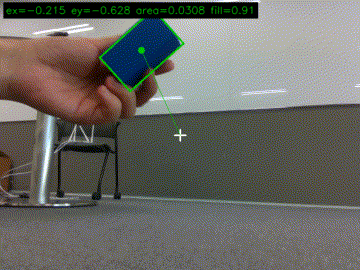 | 487 / 494 | 손 · 회전한 블록도 검출 |
   | 조명 변화, 비슷한 색 판 · 컵이 배경에 있음 | 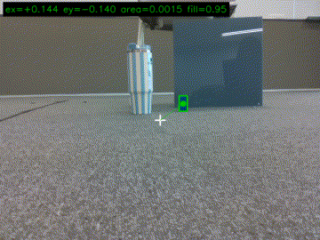 | 123 / 123 | 큰 청회색 판을 목표로 잡지 않음 |
   | 하늘색 셔츠 앞에서 블록 이동 | 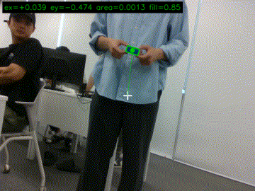 | 47 / 49 | 비슷한 색 셔츠를 목표로 잡지 않음 |

   검출 프레임 수는 `presentation.md` "필터 근거와 bag 시험" 표의 값이다 (`batch_detect` 재처리, 6프레임 간격, color만 사용해 depth 거리 필터 미반영). 노드의 검출 비율이며 사람이 대조한 검출률이 아니다.

   발제의 3종 장면 (2026-10-08 11:55 실시간 실행, 정조은. `use_control:=false`로 모터 없이 카메라 · 인지 · center만 실행, [`s2_bringup_log.txt`](https://drive.google.com/file/d/1HGWvLAv1valdrE6wjmR7f-A4eVoQnLev/view)). 검출 출력은 [`s2_detect.csv`](https://drive.google.com/file/d/1-mpMuIG_vYOaNmOuvA_hv1DbDk0Ji4CB/view).

   | 장면 | 원본 | 마스크 | 검출 결과 | 출력 |
   |---|---|---|---|---|
   | 목표 잘 보임 | 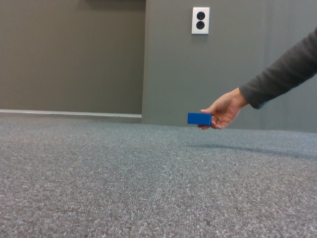 | 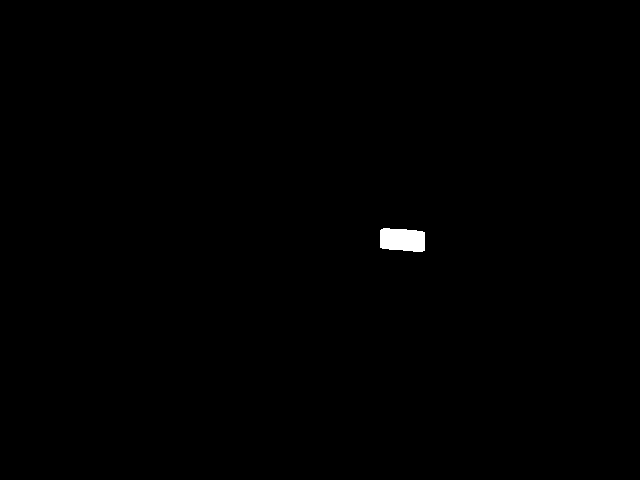 | 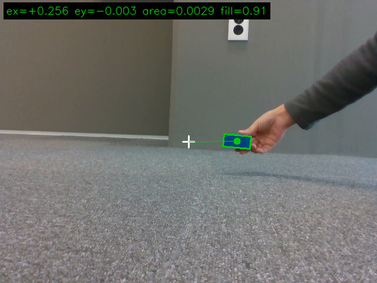 | 검출, `x=0.2564`, `z=0.00287`, 채움률 0.91 |
   | 목표 없음 | 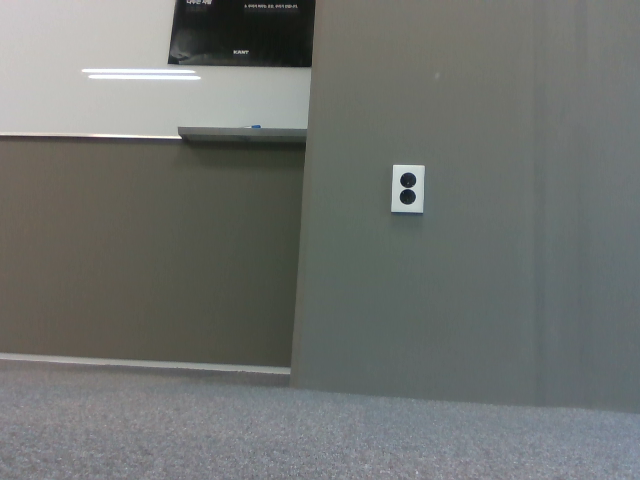 |  | 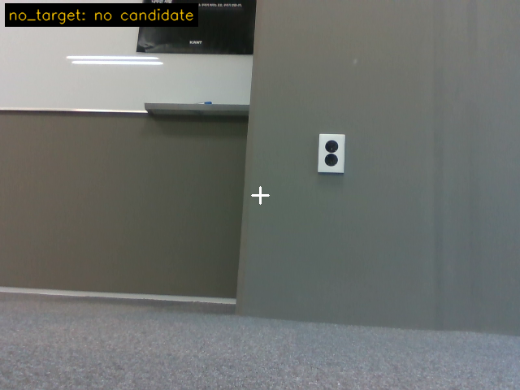 | 미검출 (`no candidate`), `z=0` |
   | 완전 가림 (블록 앞을 상자로 가림) | 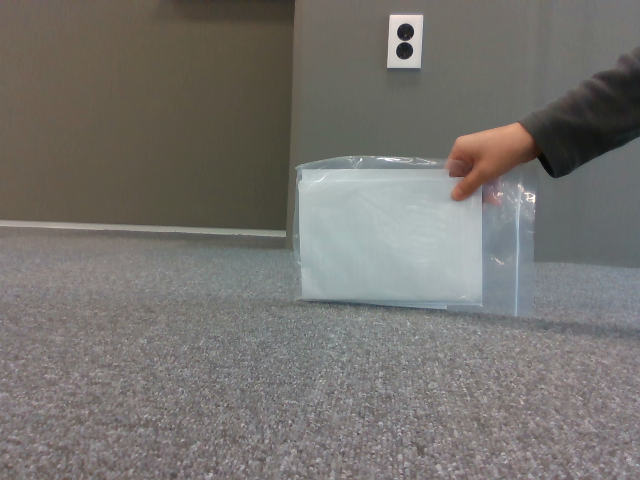 |  | 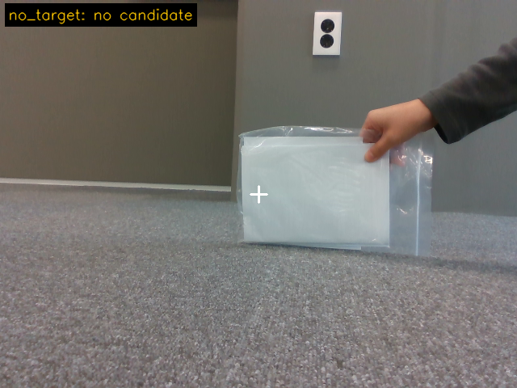 | 미검출 (`no candidate`), `z=0` |
   | 일부 가림 (블록 일부만 보임) | 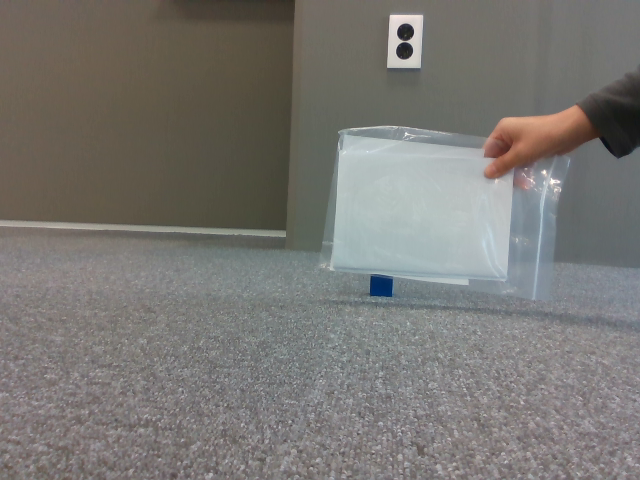 | 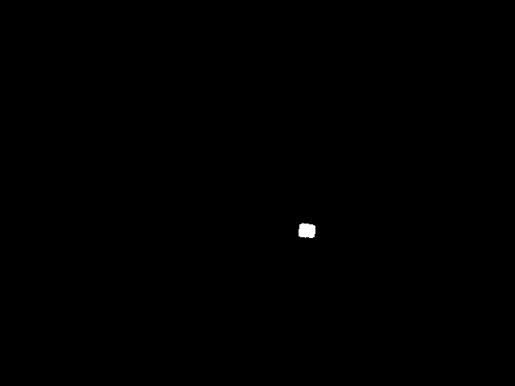 | 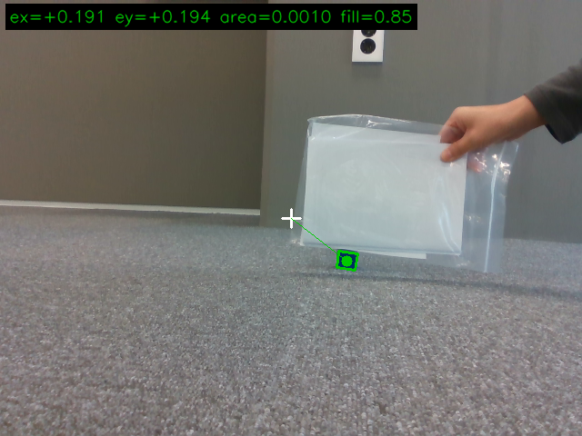 | 검출, `x=0.1911`, `z=0.00099`, 채움률 0.85 |

   미검출 장면은 이전 좌표를 재사용하지 않고 `x = y = z = 0`으로 발행했다.

4. 측정 결과: 사람이 대조한 평가 프레임으로 검출률 30/30, 배경 오검출 0/10 ("성능 측정 및 해석" 절).
5. 해석: HSV 범위 근거는 [`s2_hsv_tuning.md`](https://drive.google.com/file/d/1BQVwcYnssplFIyEm9iozcsj6GN_e5KUD/view) (정조은). 2026-10-06 실습실 bag 7개(5957프레임)를 설정 A(이전 HSV `[98,120,40]~[130,255,255]`, 면적만) · B(새 HSV, 면적만) · C(새 HSV + 채움률 + 거리)에 함께 넣어 비교했다.

   | 장면 | 프레임 | A | B | C |
   |---|---|---|---|---|
   | 대상 없음 (여러 배경) | 926 | 오검출 210 | 0 | 0 |
   | 파란 줄무늬 텀블러만 | 651 | 오검출 13 | 0 | 0 |
   | 청회색 보드 + 블록 (조명 변화) | 737 | 보드 선택 287 | 1 | 1 |
   | 남색 옷 사람 + 블록 | 644 | 옷 선택 61 | 0 | 0 |
   | 하늘색 셔츠 + 손에 든 블록 | 289 | 276 검출 | 274 | 274 |
   | 손에 든 블록 | 1419 | 1314 검출 | 1314 | 1309 |
   | 바닥의 먼 블록 | 1291 | 1291 검출 | 948 | 948 |

   - S 하한 120 → 190: 보드 · 남색 옷 · 텀블러 · 배경 물체는 H가 블록과 겹치지만 채도가 낮다. 하한을 올려 위 오검출 · 잘못된 선택을 0~1로 줄였다.
   - H 상한 130 → 118: 보라 쪽 제외. V 40~255 → 25~230: 그늘진 면은 살리고 흰 반사광은 뺐다.
   - 대가: 바닥의 먼 블록 343프레임(1291 → 948)을 놓친다. 먼 거리 · 낮은 채도 조건의 미검출이 늘어난 것은 한계로 남긴다.
   - 비교 이미지 (A → B, 같은 프레임): `results/images/s2/3_hsv/s2_hsv_cmp_board.png`, `_navy_clothes.png`, `_none.png`, `_tumbler.png`, `_far_puck.png`.
7. 한계: 3종 장면은 PC에 연결한 D435로 실행한 결과다 (RPi 아님). 먼 블록 미검출(위 표). `shirt` GIF에 사람 얼굴이 찍혀 있어 제출 전 공개 가능 여부를 확인해야 한다 (발제 "개인정보를 화면 캡처에 포함하지 않습니다").

## 인지 · 제어 인터페이스

1. 구현: `/target` (`PointStamped`, best-effort depth 1, `x · y` = 정규화 오차, `z` = 면적비 · 0이면 미검출, stamp = 원본 영상). 규약 · 토픽 표는 [`README.md`](README.md#target-규약).
2. 실행 조건: 카메라 없이 모의 발행 스크립트(`mock_seq.py`, 한지훈)로 30 Hz 모의 `/target` 발행, Kp 100, 실제 모터 구동.
3. 결과물: bag `s6_mock4`, `s6_resume2` ([`recordings/README.md`](recordings/README.md)), 입력 순서 [`s6_mock4_input.txt`](https://drive.google.com/file/d/1Um7eYtrruCewHSuy0s4KNM1mM69Vtz4L/view) · [`s6_resume2_input.txt`](https://drive.google.com/file/d/1OPFejnc0h8SpyTQYEg1AgprfdBAUAabc/view), 타임라인 [`s6_mock4_timeline.txt`](https://drive.google.com/file/d/1U9ysQ8FwGFoRf0D4jQlfjfpofevD4T8t/view) · [`s6_resume2_timeline.txt`](https://drive.google.com/file/d/1m3vY6hrib9rzQdT1FY3wBEkOCRF4gnN4/view) (모두 [Drive `s6_stop`](https://drive.google.com/drive/folders/1AGcMMttdh3As6kBuQ-xEOScs2b4wZEpm)).
4. 측정 결과:

   | 입력 | 기대 결과 | 관찰 (실측 `/motor/state`) | 판정 |
   |---|---|---|---|
   | `x=0, z>0` | 불필요한 회전 없음 | 0.06 s 만에 TRACKING, 정지 유지 | 통과 |
   | `x=+0.3, z>0` | 오른쪽으로 회전 | yaw 2023 → 1768 (tick 감소 = 오른쪽), 약 255 tick/s | 통과 |
   | `x=-0.3, z>0` | 왼쪽으로 회전 | yaw 1791 → 2023 | 통과 |
   | `z=0` | 이전 목표를 쫓지 않고 정지 | 입력과 동시에 LOST(NO_TARGET), 약 20 tick 더 이동 후 정지 | 통과 |
   | 발행 중단 | 타임아웃 후 정지 | 약 0.5 s 뒤 LOST(TIMEOUT) (`s6_resume2`: 0.55 s) | 통과 |

5. 해석: `z=0` 뒤 약 20 tick 이동은 위치형 모터가 직전에 받은 목표 위치까지 가는 거리로 본다 (가설, 직전 명령과 정지 위치 대조 필요). 미검출(`z=0`, 즉시 LOST)과 토픽 침묵(0.5 s 뒤 LOST)을 다른 경로로 처리한다.
6. 심화: 해당 없음.
7. 한계: 발제 값 ±0.4 대신 ±0.3으로 시험했다. `s6_mock` ~ `s6_mock3`은 RPi에서 center를 재빌드하지 않은 예전 빌드로 실행돼 이동 결과가 무효다 (상태 판정만 유효).

## P 추적 및 구동 제한

1. 구현: `center_node`가 `목표 = 실측 − Kp × 오차`를 `/target` 수신마다 계산 (dt 없음). 데드밴드 0.03, 1회 최대 이동 100 tick, `center.yaml` 범위 clamp, 펌웨어 안전 범위 · 속도 상한.
2. 실행 조건: 설정 [`config/control_kp20.yaml`](config/control_kp20.yaml) / [`config/control_kp40.yaml`](config/control_kp40.yaml) (Kp 외 동일), 기준 커밋 `c1d748c`, 거리 1.0 m, 실행자 한지훈, 2026-10-08.
3. 결과물:

   방향 확인 ([`s3_direction.txt`](https://drive.google.com/file/d/169s66uOPNiZeoaqaTlq3OSjtL4pDIm1Q/view), Kp 20): 블록을 화면 오른쪽에 두었을 때 `/target x` 0.800 → 0.784로 감소, `/motor/state` yaw 1725 → 1722 (tick 감소 = 오른쪽). 부호 정상.

   | 회차 | Kp | 시작 | bag 기간 | `/target` | `/motor/state` | `/motor/command` | bag |
   |---|---|---|---|---|---|---|---|
   | 1 | 20 | 18:44:02 | 17.0 s | 476 | 835 | 510 | `s3_kp20_run1` |
   | 2 | 20 | 18:44:57 | 17.4 s | 503 | 868 | 373 | `s3_kp20_run2` |
   | 3 | 20 | 18:45:31 | 17.2 s | 515 | 859 | 495 | `s3_kp20_run3` |
   | 4 | 40 | 18:48:20 | 17.5 s | 524 | 874 | 461 | `s3_kp40_run1` |
   | 5 | 40 | 18:49:14 | 17.4 s | 521 | 869 | 512 | `s3_kp40_run2` |
   | 6 | 40 | 18:49:44 | 16.6 s | 471 | 823 | 435 | `s3_kp40_run3` |

   bag 링크 · 해시: [`recordings/README.md`](recordings/README.md). 6회 모두 기록 정상.

4. 측정 결과: bag 6개를 `rosbag2_py`로 읽어 계산 (bag 재생 없음). 원본 출력 `results/logs/s3_kp/kp_metrics.csv`, 요약 `results/metrics.csv`.

   - 프레임 = `/target` 메시지 1개. 상태 = 그 프레임 직전에 받은 `/tracking_status`.
   - 유효 프레임 = 검출(`z > 0`)이고 상태가 TRACKING. RMSE = `sqrt(mean(e²))`, 유효 프레임만. 유효 추적 비율 = 유효 / 전체 × 100.

   | 회차 | Kp | 전체 프레임 | 검출 | 유효 | 제외 | 유효 추적 비율 | RMSE `ex` | RMSE `ey` | 최대 \|`ex`\| |
   |---|---|---|---|---|---|---|---|---|---|
   | 1 | 20 | 476 | 476 | 476 | 0 | 100.0 % | 0.4616 | 0.1588 | 0.831 |
   | 2 | 20 | 503 | 425 | 357 | 146 | 71.0 % | 0.5330 | 0.1075 | 0.988 |
   | 3 | 20 | 515 | 499 | 482 | 33 | 93.6 % | 0.5670 | 0.0604 | 0.983 |
   | 4 | 40 | 524 | 477 | 450 | 74 | 85.9 % | 0.5115 | 0.1057 | 0.984 |
   | 5 | 40 | 521 | 521 | 503 | 18 | 96.5 % | 0.4476 | 0.1212 | 0.772 |
   | 6 | 40 | 471 | 471 | 428 | 43 | 90.9 % | 0.4423 | 0.0971 | 0.817 |
   | 평균 | 20 | | | | | 88.2 % | 0.5205 | | |
   | 평균 | 40 | | | | | 91.1 % | 0.4671 | | |

5. 해석:
   - 펌웨어 속도 상한(약 312 tick/s)을 30 FPS로 나누면 프레임당 약 10 tick이다. 오차 0.5에서 Kp 20은 약 10 tick(상한 근처), Kp 40은 약 20 tick(상한 초과)이다. **큰 오차에서는 두 설정 모두 속도 상한에 걸려 같은 속도로 움직이고, 차이는 작은 오차 구간에서만 나타날 것으로 예상**한다 ([`control_test_2026-10-08.md`](https://drive.google.com/file/d/1ZxXCqlmpjfauHtnMCoKwb8SNI966TuPd/view)).
   - 평균 RMSE `ex`는 Kp 40(0.467)이 Kp 20(0.521)보다 작다. 하지만 같은 Kp 안의 회차 차이(Kp 20: 0.462~0.567)가 두 Kp의 평균 차이(0.054)보다 커서, 3회씩으로는 Kp 40이 낫다고 결론 내리지 않는다.
   - RMSE가 0.44~0.57로 큰 것은 시험 동작이 블록을 일부러 3 s마다 좌우로 옮기기 때문이다. 옮긴 직후 모터가 속도 상한으로 따라가는 동안의 큰 오차가 회차 전체 RMSE를 좌우한다.
   - Kp 20 2회는 미검출 78프레임과 TRACKING이 아닌 68프레임이 제외돼 유효 추적 비율이 71.0 %로 가장 낮다. 최대 |`ex`| 0.988로 블록이 화면 끝까지 간 회차다.
   - 회차마다 명령 수가 다른 것(373~512)은 데드밴드 안에서 명령을 보내지 않기 때문이다.
   - `/motor/state`는 보드가 읽은 실측 위치다. 명령값을 실제 위치처럼 쓰지 않는다.
7. 한계:
   - 화면 중앙 근처에서 오차가 남은 채 정지할 수 있다: 목표를 `실측 + delta`로 잡아 작은 오차에서 목표가 실측보다 수 tick만 앞서고 마찰로 멈춘다 (발견 #2).
   - `center.yaml`의 키가 `max_delta_tick_`(밑줄)라 yaml에서 밑줄 없이 쓰면 무시된다 (발견 #4).

## 목표 소실 · 복구

1. 구현: `center_node` 상태 IDLE / TRACKING / LOST. `z=0` 1프레임 → LOST(NO_TARGET), 입력 0.5 s 없음 → LOST(TIMEOUT), 연속 3프레임 검출 → TRACKING(TARGET_CONFIRMED). LOST 중에는 `/motor/command`를 보내지 않는다.

   | 상태 | 조건 | 동작 |
   |---|---|---|
   | IDLE | 시작 후 첫 확인 전 | 명령 없음 |
   | TRACKING | 신선한 입력에서 목표 검출 | 제한 범위 안에서 추적 |
   | LOST | 미검출 또는 입력 타임아웃 | 새 명령 없음, 보드는 마지막 목표 도달 후 정지 · 500 ms 뒤 HOLD |
   | TRACKING 복귀 | 연속 3프레임 검출 | 제한된 명령으로 재개 |

2. 실행 조건: Kp 40, 블록을 중앙에서 추적하다가 손바닥으로 블록 전체를 약 2 s 덮었다가 뗌 (시야 안 재등장).
3. 결과물: bag `s5_lost`, 상태 기록 [`s5_lost_states.txt`](https://drive.google.com/file/d/1e_3MBIc93p6ufbPbCZEJTd31jTPmFQG2/view), 메모 [`s5_memo.txt`](https://drive.google.com/file/d/1khXNmGvyDq3Jw2AgxJhjJC0DrIta2Rn-/view).

   bag `s5_lost`를 `rosbag2_py`로 읽어 계산 (bag 재생 없음). 원본 출력 `results/logs/s5_occlusion/recovery_times.csv`.

   | 회차 | LOST | 첫 재검출 | TRACKING 복귀 | 재검출 → 복귀 (하한) | LOST → 복귀 (상한) | 결과 |
   |---|---|---|---|---|---|---|
   | 1 | 0.966 s | 4.032 s | 4.101 s | 0.069 s | 3.135 s | TRACKING 복귀 |
   | 2 | 6.269 s | 8.936 s | 9.004 s | 0.068 s | 2.735 s | TRACKING 복귀 |
   | 3 | 11.205 s | 13.506 s | 13.573 s | 0.068 s | 2.368 s | TRACKING 복귀 |
   | 4 | 16.375 s | 18.343 s | 18.410 s | 0.067 s | 2.035 s | TRACKING 복귀 |
   | 5 | 20.946 s | 22.979 s | 23.048 s | 0.069 s | 2.102 s | TRACKING 복귀 |

   - 시각은 `/tracking_status` · `/target`의 bag 수신 시각(bag 첫 메시지 기준)이다. center 로그 기준 [`s5_lost_states.txt`](https://drive.google.com/file/d/1e_3MBIc93p6ufbPbCZEJTd31jTPmFQG2/view)와 0.01 s 안에서 같다.
   - 실제 재등장(손을 뗀 순간)은 LOST와 첫 재검출 사이 어딘가다. 그래서 복구 시간(복귀 − 재등장)은 "재검출 → 복귀"(하한)와 "LOST → 복귀"(상한) 사이에 있다.

   25.41 s LOST는 기록 끝에 블록을 치운 것이라 회차에 넣지 않는다. 상태 시각은 [`control_center_log_2026-10-08.txt`](https://drive.google.com/file/d/1fLya7pdM65yJ-PVzN94eGamKlVPWIOdn/view)의 STATE 줄을 bag 시작 시각에 맞춰 다시 확인했다.

   모의 입력 복귀 (`s6_resume2`): `z=0` 즉시 LOST(NO_TARGET) → `x=+0.3` 입력 0.07 s(약 3프레임) 뒤 TRACKING.

4. 측정 결과:
   - 5회 모두 가린 첫 미검출 프레임에 LOST(미검출 → LOST 0.001 s 이내), 5회 모두 TRACKING 복귀. 복귀 실패 0회.
   - 재검출 → 복귀: 5회 모두 0.067~0.069 s. 30 FPS에서 연속 3프레임(첫 프레임 + 2프레임 간격 약 0.067 s)을 확인하는 시간과 맞는다.
   - 복구 성공 기준(재등장 후 3 s 이내): 2~5회는 상한(2.04~2.74 s)도 3 s 이내라 **성공 확정**. 1회는 상한 3.135 s가 3 s를 넘어 bag만으로는 판정하지 못했다 (하한 0.069 s).
5. 해석: 복구는 시야 안 재등장 후 재검출이다. 시야 밖 탐색(SEARCHING)은 구현하지 않았다.
7. 한계:
   - 첫 시도 `s5_lost_fail1`은 가림이 LOST로 잡히지 않았다 (center 로그에서 0.1~0.7 s 짧은 LOST/TRACKING 반복).
   - Drive의 [`s5_lost_timeline.txt`](https://drive.google.com/file/d/1r1MTPIrV7lh3WlK1xu5DoQTuW4q3zgu-/view)는 이름과 달리 `s5_lost_fail1` bag의 타임라인이다 (bag 기간 21.9 s, `z=0` 입력 없음). `s5_lost` 결과로 인용하지 않는다.

## 통신 중단 안전 정지

1. 구현: 상위 — `center_node` 입력 타임아웃 0.5 s (확인 주기 0.05 s). 보드 — 펌웨어 `CMD_TIMEOUT_MS = 500`: 올바른 G · H 명령이 500 ms 없으면 정지 (flags TIMEOUT).
2. 실행 조건: 카메라 · 실제 블록, Kp 40, bag `s6_stop` 18:54:49~18:58:09 (기록 종료가 정상 처리되지 않아 `ros2 bag reindex`로 정리).
3. 결과물: [`s6_stop_states.txt`](https://drive.google.com/file/d/1dU4cB7DSBhWoQxdfRedp8gC6n28va3bo/view), [`s6_cut_times.txt`](https://drive.google.com/file/d/1UR3yRNDyvPLn6-J3TBC7qjx8Ej5Si386/view), [`s6_stop_timeline.txt`](https://drive.google.com/file/d/1gdqo_3e0HuZC5lxV9KTOgPD257gxVIzy/view), [`s6_center_log.txt`](https://drive.google.com/file/d/1MISqHkJuCFdwpaumm-5lnE0gUokl_KoL/view), [`s6_memo.txt`](https://drive.google.com/file/d/1MuMJxsWmDbMCy0kxaXj8yuEwhBATl7g7/view).

   | 시험 | 끊은 시각 | 방법 | 관찰 | 판정 |
   |---|---|---|---|---|
   | 토픽 중단 | 18:55:05.23 (기록 약 16 s) | `perception_node` 종료 | 마지막 큰 이동 15.37 s (yaw 1456) → 16.05 s TRACKING → LOST(TIMEOUT), 마지막 입력 후 0.54 s. 16~61 s yaw 변화 없음. 61.08 s 인지 재실행 → TRACKING | 통과 |
   | 제어 통신 중단 | 18:55:57.43 (기록 약 68 s) | `pkill -9 -f control_node` | 끊기 전 마지막 실측 yaw 1790 (64.89 s). 68~79 s 위치 변화 없음. 79.51 s 재실행 후 위치 차이 20 tick 미만 | 통과 (아래 한계) |

   보드 측 정지: `results/logs/fw_timeout_test_2026-10-06.txt` — flags 0(명령 수신 중) 25줄(50 Hz 기준 약 0.5 s) 뒤 3(HOLD + TIMEOUT)으로 바뀌는 구간이 2회 있다.

4. 측정 결과: 토픽 중단 → LOST 0.54 s (타임아웃 0.5 s + 확인 주기 0.05 s 이내). 정지 판정 기준: [`s6_stop_timeline.txt`](https://drive.google.com/file/d/1gdqo_3e0HuZC5lxV9KTOgPD257gxVIzy/view)는 yaw 20 tick 이상 변화만 출력하므로 "변화 없음"은 20 tick 미만이다.
5. 해석: 상위 노드(인지)가 끊기면 center가, 제어 통신이 끊기면 보드가 각각 정지시킨다. 마지막 명령으로 계속 움직이지 않는다.
7. 한계:
   - 제어 통신을 끊은 순간 이동이 작았다 (끊기 전 yaw 1789~1794 명령). 큰 이동 중 끊었을 때의 정지는 이 bag으로 보이지 않고, 보드 0.5 s 정지는 `fw_timeout_test`로 따로 확인했다.
   - `control_node` 종료 중에도 `center_node`는 TRACKING을 유지하고 `/motor/command`를 계속 발행했다 (타임라인 68.48 s 이후 명령 줄). 모터는 보드가 멈추지만 상태 표시에 드러나지 않는다 (발견 #3).
   - 무효: 18:04:10, 18:38:45에 끊은 시도는 기록 범위 밖이라 무효 (`s6_stop_fail1~2`).

## 성능 측정 및 해석

| 지표 | 계산 | 값 | 기록 조건 |
|---|---|---|---|
| 검출률 | 올바른 검출 / 목표가 실제 보이는 평가 프레임 × 100 | 30 / 30 = 100 % | 판정 목록 [`s2_eval_frames.csv`](https://drive.google.com/file/d/1CkM9o6acQY4S1F9BNddaGTukJp9z8cgj/view), 프레임 `results/images/s2/2_eval_frames/visible/` |
| 배경 오검출 | 목표 없는 평가 프레임의 잘못된 검출 수 | 0 / 10 | 프레임 `results/images/s2/2_eval_frames/empty/` |
| 수평 RMSE · 유효 추적 비율 | `sqrt(mean(ex²))`, 유효 / 전체 × 100 | Kp 6회 · 대표 bag 4개 | "P 추적" · "bag 기록 및 재현" 절. 검출 · TRACKING 프레임만, 제외 수 병기 |
| 복구 성공률 | 재등장 후 3 s 내 복귀 / 5 × 100 | 4/5 확정 (1회 판정 불가) | "목표 소실 · 복구" 절 |
| 복구 시간 | 복귀 시각 − 재등장 시각 | 회차별 하한 0.067~0.069 s · 상한 2.04~3.14 s | 실패는 0 s가 아니라 "실패" |

검출 판정 조건: 2026-10-08 11:55 실시간 실행(PC + D435, 모터 없음) 중 저장한 프레임. 목표 보임 30장(약 2.67 s 간격) · 목표 없음 10장. 각 프레임의 `target_visible`(사람 판단)과 노드 출력 `detected`를 대조해 `correct` 열에 기록했다 (정조은, 검토 시트 `results/images/s2/2_eval_frames/s2_eval_review_sheet.jpg`). 30장 중 11~25번은 블록이 거의 같은 위치(`x ≈ 0.193`)에 놓인 장면이라 위치 · 거리 다양성이 낮다. 이 100 %는 이 조건의 결과이며, 위 HSV 비교의 "바닥의 먼 블록" 미검출이 보여 주듯 먼 거리에서는 낮아진다.

참고 (대체 조건): 같은 실시간 실행의 `perception_node` 로그에 5 s 구간 처리 FPS 29.8~30.0이 찍혔다 (시작 구간 24.8 제외, [`s2_bringup_log.txt`](https://drive.google.com/file/d/1HGWvLAv1valdrE6wjmR7f-A4eVoQnLev/view)). PC에서 실행한 값이라 RPi 처리 FPS로 쓰지 않는다. 또 PC에서 `recording_02` 영상을 재생해 처리한 `perception_node` 로그에 5 s 구간 처리 FPS 25.6 / 30.0 / 30.0이 찍혔다 ([`perception_node.log`](https://drive.google.com/file/d/1xjNHA7FwoppYLvdk02OByxHUBtxm4F34/view)). PC 재처리 값이라 RPi 실시간 처리 FPS로 쓰지 않는다. 노드의 검출 비율(`recording_02` 446프레임 중 200 검출)도 사람이 대조한 검출률이 아니다.

## bag 기록 및 재현

1. 구현: 성공 · 소실 bag과 시험 bag을 Drive에 폴더째(`metadata.yaml` + `.mcap`) 보관하고 [`recordings/README.md`](recordings/README.md)에 링크 · 크기 · SHA-256 · 토픽을 정리했다.
2. 실행 조건 (입력 재처리): 실행자 정조은, PC (Ubuntu 24.04, ROS 2 Lyrical, OpenCV 4.6.0), 기준 커밋 `12f6d71`, `config/perception.yaml` 그대로, **모터 출력 꺼짐** (control · center 미실행, OpenCR 미연결). 영상 · depth 토픽만 재생하고 출력은 `/target_replay`로 바꿔 저장된 `/target`과 섞지 않았다.
3. 결과물: [Drive `s7_replay`](https://drive.google.com/drive/folders/1K771K-eEIXJ_XX0-L-Czj5EHuL6AmCt4) — [`s7_memo.txt`](https://drive.google.com/file/d/1iGOthntzHd6mILcthx7pY0fZarG1l-cM/view), 프레임별 비교 [`s7_replay_target.csv`](https://drive.google.com/file/d/1e18WerSBKFR8R4dQQZesQHLQKDxOpUWU/view), `run1/` · `run2/` (원본 CSV, 재처리 CSV, [`compare_result.txt`](https://drive.google.com/file/d/1ena8iebdDZGpU2AfpDpssNBBgL87h1oR/view)), 재처리 bag `replay_recording_02` · `replay_mine`.

   | 재현 | 수행 내용 | 결과 |
   |---|---|---|
   | 입력 재처리 1차 | `recording_02` 영상 447장을 검출기로 다시 처리 | 같은 프레임 446개, 검출 판정 일치 446/446 (검출 200 · 미검출 246), 둘 다 검출된 200프레임 \|ex\| 차이 평균 · 최대 0.0000 |
   | 입력 재처리 2차 | 같은 절차를 다시 실행 | 같은 프레임 445개, 일치 445/445, \|ex\| 차이 0. 재생 시작 직후 영상 2장 누락 |
   | 결과 재분석 | 저장된 `/target` · `/tracking_status`로 지표 재계산 (bag 재생 없이 `rosbag2_py`로 읽음, 모터 무관) | 아래 표. `recording_02`의 LOST 7회는 정조은 분석 [`lost_episodes.csv`](https://drive.google.com/file/d/1xEZseKNj8r9ipCsQ3zMA8FiwNnfJIdpI/view) 7건과 일치 |

   결과 재분석 (`results/logs/reanalysis/reanalysis.csv`, 정의는 "P 추적" 절과 같음: 유효 = 검출이고 TRACKING):

   | bag | 전체 프레임 | 검출 | 유효 | 유효 추적 비율 | RMSE `ex` | LOST 진입 |
   |---|---|---|---|---|---|---|
   | `success_01` | 622 | 531 | 524 | 84.2 % | 0.2044 | 2 |
   | `fail_01` | 753 | 521 | 482 | 64.0 % | 0.1661 | 11 |
   | `recording_02` | 446 | 200 | 176 | 39.5 % | 0.5538 | 7 |
   | `recording_01` | 413 | 297 | 294 | 71.2 % | 0.3669 | 2 |

4. 측정 결과: 프레임은 영상 `header.stamp`로 맞췄다. 1차의 재처리 전용 1프레임은 녹화 시작 직후 첫 영상(원본 `/target`이 bag에 없음)이다.
5. 해석:
   - 같은 영상 · 같은 설정으로 다시 검출하면 녹화 당시와 같은 결과가 나왔다. 녹화 당시에도 같은 `perception.yaml`이었다는 근거가 된다.
   - 2차의 앞 2장 누락은 `bag play`가 노드 연결(discovery) 전에 보낸 영상을 best-effort · depth 1 구독이 받지 못한 것이다. `ros2 bag play -d 2`로 막는다.
   - 입력 재처리는 검출기를 다시 실행해 검출 단계를 재현한다. 결과 재분석은 저장된 출력으로 지표를 다시 계산해 성능표를 검산한다. 입력 재처리는 `recording_02`로, 결과 재분석은 네 bag으로 했다.
   - 오프라인 입력 재현이며 실제 하드웨어 폐루프 시연이 아니다.
7. 한계:
   - 성공 · 소실 대표 bag(`success_01` · `fail_01`)은 영상 토픽이 없어 결과 재분석만 가능하다. 결과 재분석은 에이전트가 PC에서 실행했다.
   - `fail_01`은 RMSE가 `success_01`보다 작지만 유효 추적 비율이 64.0 %로 낮다. 놓친 프레임이 RMSE에서 빠지므로 RMSE만으로 추적 품질을 판단하지 않는다.
   - [`perception_node.log`](https://drive.google.com/file/d/1xjNHA7FwoppYLvdk02OByxHUBtxm4F34/view)에 실행자 PC의 절대 경로가 남아 있다 (원본 로그라 그대로 보존).

---

## 실패 · 무효 기록

| 기록 | 사유 | 유효 범위 |
|---|---|---|
| `s6_mock` ~ `s6_mock3` | RPi에서 center를 재빌드하지 않아 예전 빌드(dt 적용) 실행. Kp 100 · 오차 0.3에서 delta −1.0 (소스 기준 −30) | 상태 판정만 유효 |
| `s6_mock2_fail1`, `s6_mock3_fail1` | 입력 없이 기록만 됨 (`mock_seq.py` 경로 오류 등) | 무효 |
| `s6_resume` | center 2개 중복 실행 | 무효 |
| `s6_stop_fail1`, `s6_stop_fail2` | 기록 범위 밖에서 시험 / 시험 전에 기록 종료 | 무효 |
| `s5_lost_fail1` | 가림이 LOST로 잡히지 않음 | 재시험(`s5_lost`) |
| 끊은 시각 18:04:10, 18:38:45 | 기록 없이 수행 | 무효 |

출처: [`control_test_2026-10-08.md`](https://drive.google.com/file/d/1ZxXCqlmpjfauHtnMCoKwb8SNI966TuPd/view), [`s6_memo.txt`](https://drive.google.com/file/d/1MuMJxsWmDbMCy0kxaXj8yuEwhBATl7g7/view).

## 시험 중 발견 사항

| # | 내용 | 영향 | 제안 |
|---|---|---|---|
| 1 | 코드 갱신 후 RPi에서 재빌드하지 않아 예전 빌드 실행 | 모의 시험 3건 이동 결과 무효 | 재빌드 · 노드 재실행 후 시작 로그로 확인 |
| 2 | 목표를 `실측 + delta`로 계산 | 작은 Kp · 작은 오차에서 중앙 근처 정지 | `직전 목표 + delta` (실측 대비 앞섬 제한) |
| 3 | `control_node` 종료를 center가 감지하지 못함 | 상태 표시가 TRACKING으로 남음 | `/motor/state` 끊김 감지 |
| 4 | 파라미터 이름 `max_delta_tick_` | yaml 값이 무시될 수 있음 | 이름 정리 |
| 5 | pitch 범위 밖(3235)에서 부팅 시 모터가 붙잡지 못함 | 시작 불가 | 전원 끄기 전 원점 복귀, 범위 밖이면 손으로 옮긴 뒤 부팅 |
| 6 | `ros2 bag record` 백그라운드 실행 시 키보드 입력 대기로 정지 | 기록 실패 | 입력을 `/dev/null`로 연결 |

## 전체 한계 · 개선 방향

- 조건 차이: 모의 입력 ±0.3 (발제 ±0.4), Kp 계획 10 / 20 → 시험 20 / 40.
- 대체 환경: 입력 재처리는 RPi가 아닌 PC에서 수행.
- 개선 방향: 발견 사항 #2 · #3 반영.
